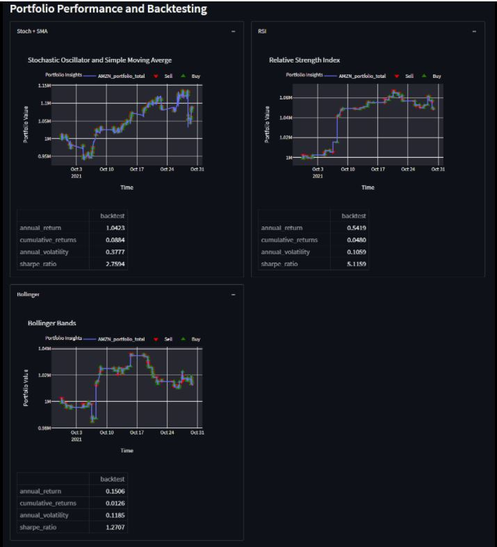

# Algo Trading with Dashboard

This project is an backtested algorhytmic trading strategy.  It utilizes a Stochastic Osccillator, Bollinger Bands, and RSI indicators to create a buy or sell signal.  These indicators are useful for pursuing a momentum trading strategy.  The Stochastic Osicillator is based on the current price and the highest and lowest price of the past 14 days.  The Bollinger Bands provide similar momentum signals but they are based on crossing over the two standard deviations from the mean. The RSI or Relative Strength Index formula is based over a 14 period similar to the Stochastic Oscillator, but utilizes the percentage return rather than the price movements. 

## Technologies
This use project uses Python 3.8 and iPython in Jupyter Lab.  Windows 10 is the operating system.

## Libraries Uses
    
    Pandas - used to create dataframes and manipulate data in    dataframes
    Numpy - used to perform calculations on data
    Pathlib - path library used to set filepath
    Os - used to access operating system
    Requests - used to pull API data
    Dotenv - loads environment files
    Alpaca_trade_api - used to get API files from Alpaca
    Matplotlib - used to graphically display data and calculations
    Streamlit - installed as a package to run dashboards
    Plotly - used to create displays for returns 
    

## Installation Guide
This project requires a Python Environment with Python 3.8 and additional installations of alpaca_trade_api and dotenv.  It requires the user to import requests, os, numpy, and pandas. 

## Examples

## Usage

To use this dashboard, navigate to the portion of the code that houses the Alpaca REST API.  In here, change the start and end parameters to your preferred date, the timeframe of stock prices, and the ticker symbol for the stock you wish to analyze.  Run the entire program and once Streamlit has opened a new browser window, hit the run bottom to display the graphs. ALternatively, a CSV can be fed into the program rather than using Alpaca REST API. 

## Contributors
Ryan Dibeler, Thomas Revelle, Shishir Suman, Matthew Wilson

## License
MIT License

Copyright (c) [2021] [Ryan Dibeler,Thomas Revelle, Shishir Suman, Matthew Wilson]

Permission is hereby granted, free of charge, to any person obtaining a copy
of this software and associated documentation files (the "Software"), to deal
in the Software without restriction, including without limitation the rights
to use, copy, modify, merge, publish, distribute, sublicense, and/or sell
copies of the Software, and to permit persons to whom the Software is
furnished to do so, subject to the following conditions:

The above copyright notice and this permission notice shall be included in all
copies or substantial portions of the Software.

THE SOFTWARE IS PROVIDED "AS IS", WITHOUT WARRANTY OF ANY KIND, EXPRESS OR
IMPLIED, INCLUDING BUT NOT LIMITED TO THE WARRANTIES OF MERCHANTABILITY,
FITNESS FOR A PARTICULAR PURPOSE AND NONINFRINGEMENT. IN NO EVENT SHALL THE
AUTHORS OR COPYRIGHT HOLDERS BE LIABLE FOR ANY CLAIM, DAMAGES OR OTHER
LIABILITY, WHETHER IN AN ACTION OF CONTRACT, TORT OR OTHERWISE, ARISING FROM,
OUT OF OR IN CONNECTION WITH THE SOFTWARE OR THE USE OR OTHER DEALINGS IN THE
SOFTWARE.
